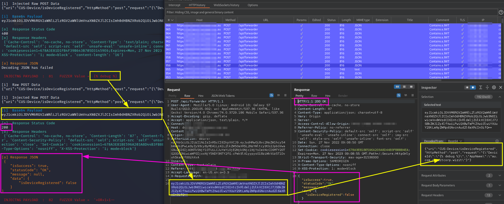

# Inject Payload API Base64 body

Inject Payload into API that only accept base64 encode POST data  

## API Penetration Testing  

The mobile application makes POST requests to the API backend in the base64 encoded body. 
This restricts the simple injection and fuzzing of input parameters to the API endpoint.
The following script aims to enable the injection of payloads in specific positions to test input validation.  


### Execute the script with input file contain list of payload injections sample on each line.  
```bash
python Fuzz-API-Forwarder-b64-3.py payload-list1.txt
```


